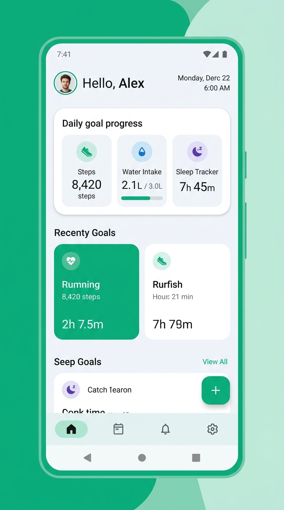
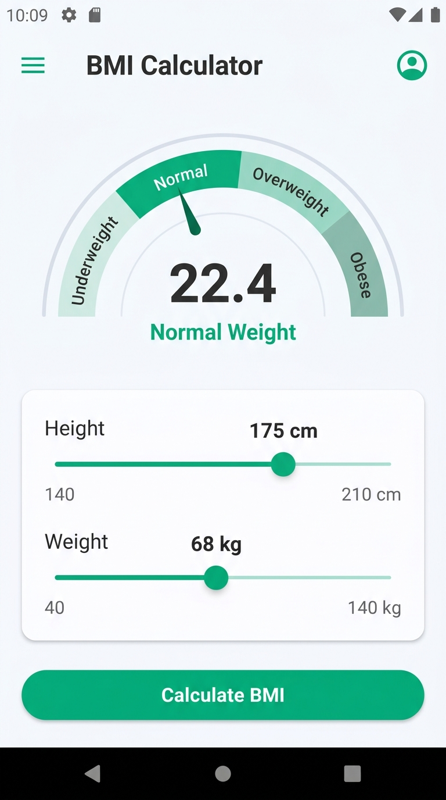
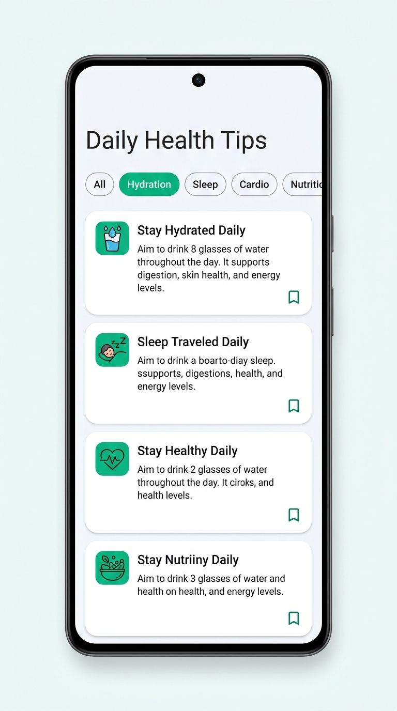
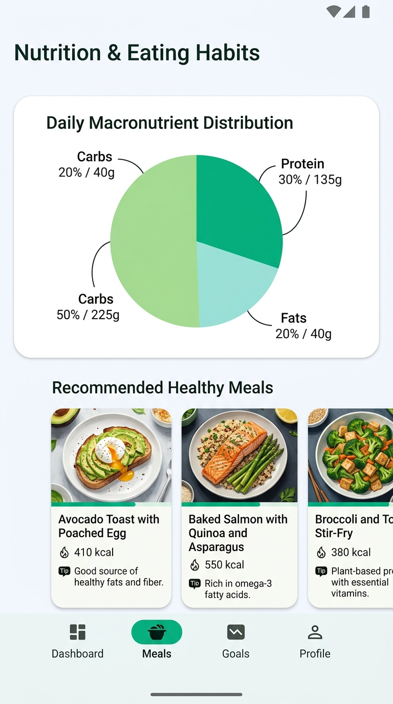
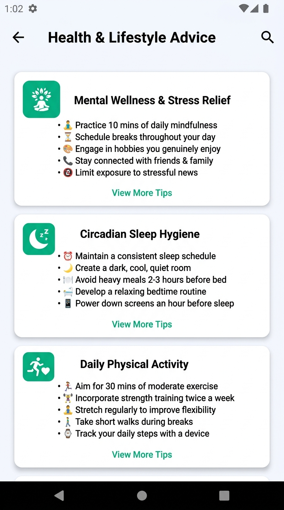

# 🌿 Health & Wellness Android Application

[](https://developer.android.com)
[](https://kotlinlang.org)
[](https://m3.material.io/)
[](https://developer.android.com/guide/navigation)

A native Android mobile application designed to help users track personal biometric indicators, discover curated health tips, and follow structured nutritional and wellness guidelines. Engineered with modern Android development best practices, **Single-Activity Architecture**, **Jetpack Navigation Components**, and **ViewBinding**.

---

## 📱 Features & Modules

- **📊 BMI Calculator:** 
  - Calculates Body Mass Index in real time using weight (kg) and height (cm/m).
  - Automatic WHO category categorization (*Underweight, Normal, Overweight, Obese*).
  - Defensive input sanitization and zero-division protection.
- **💡 Health Tips Feed:** 
  - Dynamic, memory-efficient list powered by `RecyclerView` with custom `ViewHolder` pattern and category chips (*Hydration, Sleep, Cardio, Nutrition*).
- **🥗 Eating Habits & Nutrition:** 
  - Informative guides on macronutrient balancing, meal timings, and balanced diet planning presented via clean `CardView` layouts.
- **🧘 Health & Lifestyle Advice:** 
  - Actionable guidance on mental wellness, stress relief, circadian sleep hygiene, and daily physical benchmarks.

---

## 📸 Screenshots

| Home Dashboard | BMI Calculator | Health Tips |
| :---: | :---: | :---: |
|  |  |  |

| Eating Habits | Health Advice |
| :---: | :---: |
|  |  |

---

## 🏗️ Architecture & Navigation

The app strictly follows Google's **Single-Activity Architecture**:
- **Host Activity:** `MainActivity` with `NavHostFragment`
- **Navigation Pattern:** `BottomNavigationView` synced with Android Jetpack Navigation Graph (`nav_graph.xml`)
- **UI & Lifecycle Management:** `ViewBinding` with zero memory leaks (`_binding = null` in `onDestroyView`)

---

## 🛠️ Tech Stack & Dependencies

- **Language:** Kotlin / Java
- **IDE:** Android Studio
- **Minimum SDK:** API 24 (Android 7.0)
- **Target SDK:** API 34 (Android 14)
- **Components:**
  - Android Jetpack Navigation Component
  - Material Design 3 Components (`com.google.android.material`)
  - AndroidX RecyclerView & CardView
  - Android ViewBinding

---

## 🚀 Getting Started

### 1. Clone the repository
```bash
git clone https://github.com/deshan2004/Health-Wellness-App.git
```
